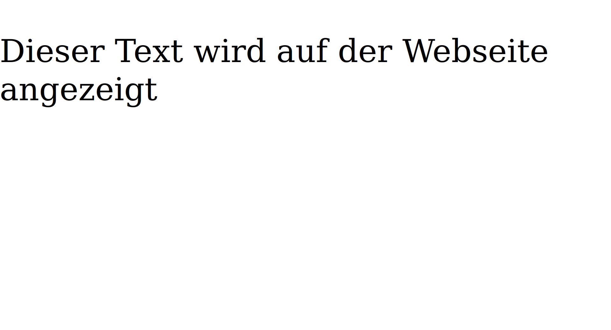
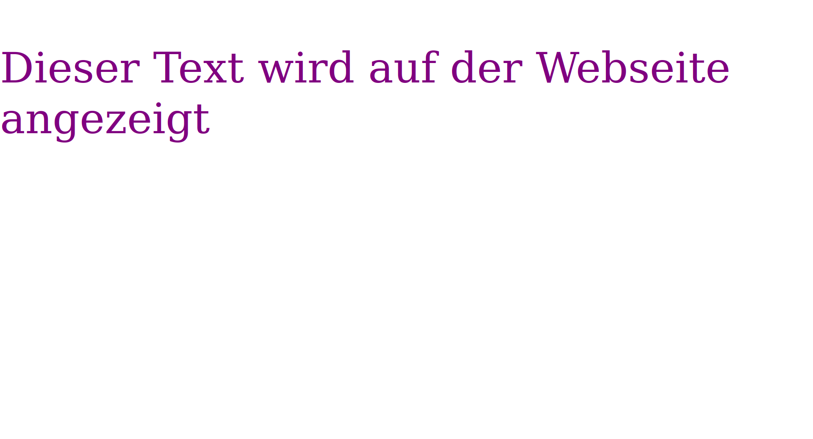
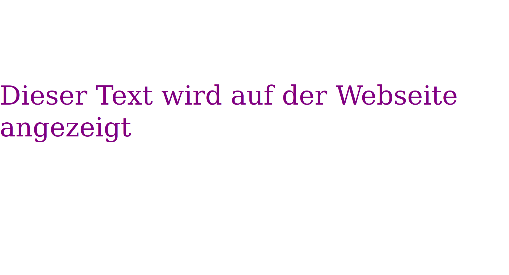
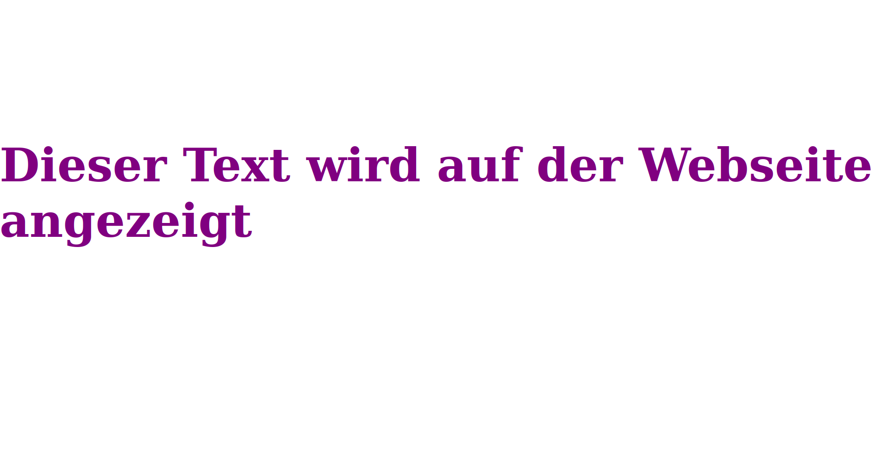
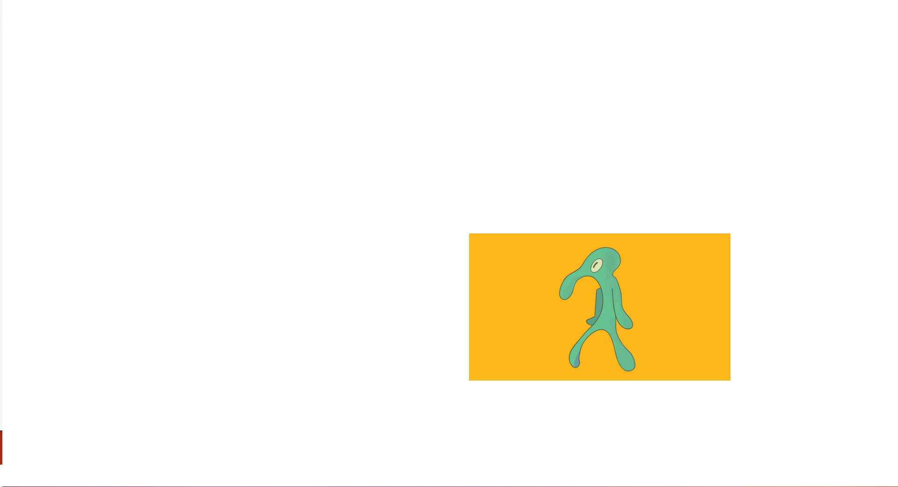
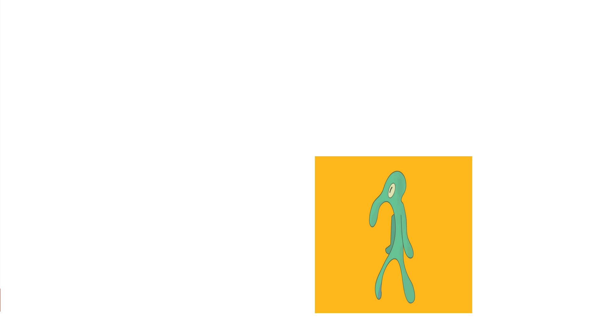
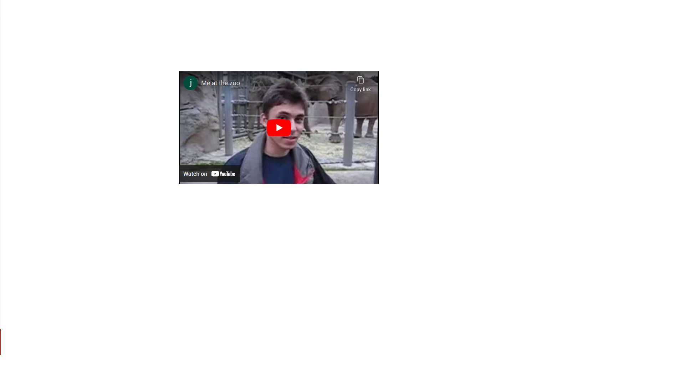
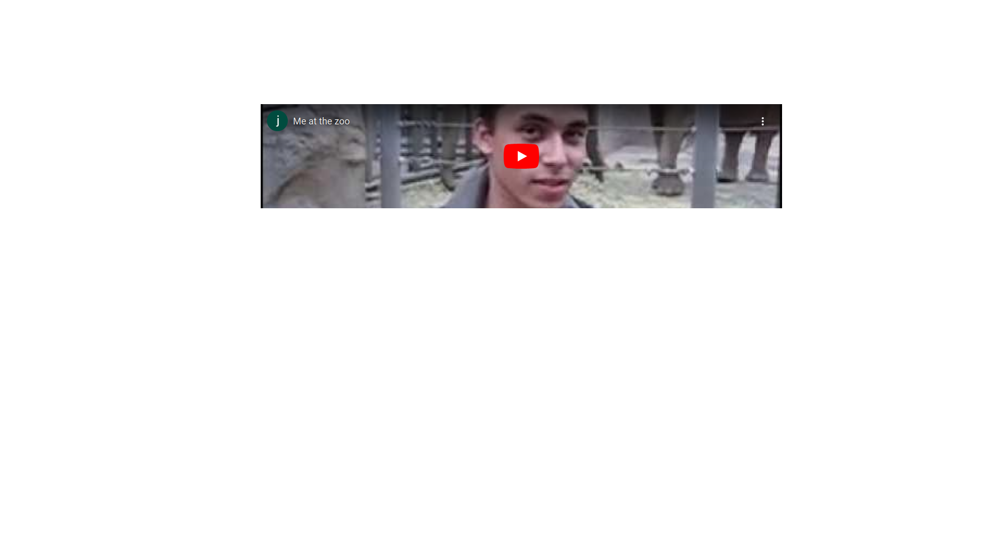
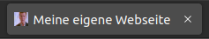

# Girls-and Boysday 2023

## Table of Contents
- [About this Project](https://github.com/AlexX1-dev/Girls-and-Boys-Day-2023#about-this-project)
- [Get Started](https://github.com/AlexX1-dev/Girls-and-Boys-Day-2023#get-started)
- [Textbausteine](https://github.com/AlexX1-dev/Girls-and-Boys-Day-2023#textbausteine)
- [Bildbausteine](https://github.com/AlexX1-dev/Girls-and-Boys-Day-2023#bildbausteine)
- [Videobausteine](https://github.com/AlexX1-dev/Girls-and-Boys-Day-2023#videobausteine)
- [Titelbausteine](https://github.com/AlexX1-dev/Girls-and-Boys-Day-2023#titelbausteine)
- [Iconbausteine](https://github.com/AlexX1-dev/Girls-and-Boys-Day-2023#iconbausteine)
- [Hintergrundbausteine](https://github.com/AlexX1-dev/Girls-and-Boys-Day-2023#hintergrundbausteine)
- [Selber kompilieren](https://github.com/AlexX1-dev/Girls-and-Boys-Day-2023#selber-kompilieren)
- [Roadmap](https://github.com/AlexX1-dev/Girls-and-Boys-Day-2023#roadmap)
- [Contact](https://github.com/AlexX1-dev/Girls-and-Boys-Day-2023#contact)


## About this Project:

Dieses Projekt wurde für den Girls- und Boys-day am 27. April 2023 erstellt. Das ist ein Tag, an dem Kinder und Jugendliche Berufe erkunden können, insbesondere Berufe, die überwiegend nicht ihrem Geschlecht zugeschrieben werden.

Die Zielgruppe ist hinsichtlich Alter und Vorwissen total heterogen. Da wir alle Kinder und Jugendliche für die Anwendungsentwicklung interessieren wollten, haben wir uns für das „programmieren“ einer Webseite entschieden.

Da HTML, CSS und JavaScript Syntax für Neuanfänger echt schwer zu lernen und verstehen ist, haben wir versucht, eine möglichst einfach zu bedienende Java Libary zu schreiben, die von der Komplexität ähnlich wie Scratch ist.

Wir haben uns dazu entschieden, alles auf Deutsch zu schreiben und zu dokumentieren, damit die Kinder, die nicht so gut Englisch sprechen, ebenfalls problemlos mitmachen können.

Die Entscheidung, dass jeder Parameter ein String ist, ist ebenfalls bewusst gewählt. Verschiedene Datentypen könnten für den Anfang ebenfalls zu kompliziert sein.

Wenn ihr Anmerkungen oder Verbesserungsvorschläge habt oder Bugs findet, schickt uns bitte euer Feedback. Dies könnt ihr durch Eröffnen eines Tickets machen oder ihr schreibt uns über Teams.

## Get started:
Lade unter dem Punkt [Releases](https://github.com/AlexX1-dev/boys-and-girls-day-2023-library/releases) die aktuellste `.jar` Datei herunter oder [kompiliere sie selber](https://github.com/AlexX1-dev/Girls-and-Boys-Day-2023#selber-kompilieren). Und füge sie anschließend deinem Projekt als Library hinzu.

Erstelle um zu starten eine Instanz von der Klasse WebseitenBuilder.
    
```java
WebseitenBuilder webseite = new WebseitenBuilder();
```

Jeder Baustein hat eine eigene einzigartige ID. Diese kann benutzt werden, um den Baustein zu bearbeiten. Die ID kann aus Buchstaben, Zahlen und Sonderzeichen bestehen.

Einen neuen Baustein fügt man hinzu, indem man den Namen von seinen WebseitenBuilder Namen (in diesem Beispiel ``webseite``) mit einer Methode durch einen Punkt verbindet.

Eine Methode ist ein Teil eines Programmes, sie kann aufgerufen werden und weiteren Code ausführen. Es gibt zwei Arten von Methoden, mit und ohne Eingabe. Methoden ohne Eingabe führen definierten Code aus, etwas ähnlichen machen auch Methoden mit Eingabe, jedoch kann bei einer Methode mit Eingabe die Ausführung je nach Eingabe beeinflusst werden. 

Diese Eingaben nennt man Parameter.
Ein Parameter beginnt und endet mit ``"``. Wenn es mehr als ein Parameter gibt, trennt man diese mit einem ``,``.

Diese Parameter schreibt man in die Klammern ``(`` ``"Parameter"`` ``)`` direkt hinter dem Methodennamen. Um eine Zeile abzuschließen, fügt man noch ein ``;`` ans Ende.


## Textbausteine:

### Neuen Text erstellen:
Einen neuen Textbaustein erstellt man folgendermassen:

```java
webseite.Text("id_1", "Dein Text");
```

``"id_1"`` ist in diesem Beispiel die oben angesprochene ID.

``"Dein Text"`` Hier kommt dein Text, der auf der Webseite erscheinen soll rein


#### Emojis im Textfeld anzeigen:

1. Gehe auf diese [Webseite](https://www.w3schools.com/charsets/ref_emoji.asp).
2. Scrolle nach unten und suche dir ein Emoji aus.
3. Kopiere die Zahl neben dem Emoji.
4. Um das Emoji jetzt anzuzeigen, musst du folgendermaßen dein Emoji zusammenbauen:``&#`` ``Deine Zahl`` ``;``

```java
webseite.Text("id_1", "&⋕128187;");
```
``&⋕128187;`` würde diesen Laptop anzeigen: 💻


### Schriftgröße ändern:


```java
webseite.TextSchriftgroesse("id_1", "24");
```

``"id_1"`` Element ID

``"24"`` Schriftgröße

### Textfarbe ändern:


```java
webseite.TextFarbe("id_1", "green");
```

``"id_1"`` Element ID

``"green"`` Farbe (auf Englisch) oder Hexadezimal Farben Code [ z.B.: `#044000` für grün]

### Text verschieben:


```java
webseite.TextPosition("id_1", "200", "100");
```

``"id_1"`` Element ID

``"200"`` Verschiebung von dem Text nach unten [Pixelanzahl]

``"100"`` Verschiebung von dem Text nach rechts [Pixelanzahl]

### Textdicke verändern:


```java
webseite.TextDicke("id_1", "500");
```

``"id_1"`` Element ID

``"500"`` Dicke von dem Text, Zahl zwischen 100 und 900, (``400`` "standart" Schriftdicke, ``700`` "standart" Fett)

### Beispiele für Textbausteine:

```java
webseite.Text("id_1", "Dieser Text wird auf der Webseite angezeigt");
```


```java
webseite.TextSchriftgroesse("id_1", "100");
```


```java
webseite.TextFarbe("id_1", "purple");
```


```java
webseite.TextPosition("id_1", "200", "0");
```


```java
webseite.TextDicke("id_1", "900");
```



## Bildbausteine:

### Neues Bild erstellen:
Einen neuen Bildbaustein erstellt man folgendermassen:

```java
webseite.Bild("id_2", "url");
```

``"id_2"`` ist in diesem Beispiel die oben angesprochene ID.

``"url"`` Füge hier die URL von deinem Bild ein.


### Bild verschieben:

```java
webseite.BildPosition("id_2", "200", "100");
```

``"id_2"`` Element ID

``"200"`` Verschiebung von dem Bild nach unten [Pixelanzahl]

``"100"`` Verschiebung von dem Bild nach rechts [Pixelanzahl]


### Größe von Bild verändern:

```java
webseite.BildGroesse("id_2", "315", "560");
```

``"id_2"`` Element ID

``"560"`` Breite von dem Bild [Pixelanzahl]

``"315"`` Höhe von dem Bild [Pixelanzahl]

### Beispiele für Bildbausteine:

```java
webseite.Bild("id_2", "https://i.kym-cdn.com/entries/icons/original/000/016/289/Screen_Shot_2019-04-16_at_3.42.28_PM.png");
```


```java
webseite.BildPosition("id_2", "500", "1000");
```


```java
webseite.BildGroesse("id_2", "500", "500");
```



## Videobausteine:

### Neues Video erstellen:
Einen neuen Videobaustein erstellt man folgendermassen:

```java
webseite.Video("id_3", "url");
```

``"id_3"`` ist in diesem Beispiel die oben angesprochene ID.

``"url"`` Füge hier die URL von deinem Video ein.

### Video verschieben:

```java
webseite.VideoPosition("id_3", "200", "100");
```

``"id_3"`` Element ID

``"200"`` Verschiebung von dem Video nach unten [Pixelanzahl]

``"100"`` Verschiebung von dem Video nach rechts [Pixelanzahl]


### Größe von Video verändern:

```java
webseite.VideoGroesse("id_3", "315", "560");
```

``"id_3"`` Element ID

``"560"`` Breite von dem Video [Pixelanzahl]

``"315"`` Höhe von dem Video [Pixelanzahl]

### Beispiele für Videobausteine:

```java
webseite.Video("id_3", "https://www.youtube.com/watch?v=jNQXAC9IVRw");
```


```java
webseite.VideoPosition("id_3", "200", "500");
```


```java
webseite.VideoGroesse("id_3", "200", "1000");
```



## Titelbausteine:

### Titel ändern:
Den Titel deiner Webseite änderst du folgendermaßen:

```java
webseite.Titel("Das ist dein Neuer Webseiten Titel");
```

``"Das ist dein Neuer Webseiten Titel"`` Empfohlene Länge: ``20`` Zeichen, Maximal Länge: ``60``

### Beispiel für Titelbaustein:

```java
webseite.Titel("Neuer Titel der Webseite");
```


## Iconbausteine:

### Icon ändern:
Das Icon deiner Webseite änderst du folgendermaßen:

```java
webseite.Icon("url");
```

``"url"`` Füge hier den Link zu einem Bild ein.

### Beispiel für Iconbaustein:

```java
webseite.Icon("https://en.wikipedia.org/wiki/File:RickAstleyNeverGonnaGiveYouUp7InchSingleCover.jpg");
```


## Hintergrundbausteine:

### Hintergrundfarbe ändern:
Die Hintergrundfarbe deiner Webseite änderst du folgendermaßen:

```java
webseite.HintergrundFarbe("green");
```

``"green"`` Farbe (auf Englisch) oder Hexadezimal Farben Code [ z.B.: `#044000` für grün]

### Hintergrundbild ändern:
Das Hintergrundbild deiner Webseite änderst du folgendermaßen:

```java
webseite.HintergrundBild("url", "wiederholen", "abdecken");
```

``"url"`` Füge hier den Link zu einem Bild ein.

``"wiederholen"`` Soll das Hintergrundbild mehrmals angezeigt werden? [Wahr/ Falsch]

``"abdecken"`` Soll das Hintergrundbild auf die Maximale größe gestreckt werden? [Wahr/ Falsch]

#### Beispiele für Hintergrundbausteine:

```java
 webseite.HintergrundFarbe("blue");
```


```java
webseite.HintergrundBild("https://upload.wikimedia.org/wikipedia/commons/0/04/UnitedInternet_logo.svg", "Wahr", "Wahr");
```


```java
webseite.HintergrundBild("https://upload.wikimedia.org/wikipedia/commons/0/04/UnitedInternet_logo.svg", "Wahr", "Falsch");
```


```java
webseite.HintergrundBild("https://upload.wikimedia.org/wikipedia/commons/0/04/UnitedInternet_logo.svg", "Falsch", "Wahr");
```


```java
webseite.HintergrundBild("https://upload.wikimedia.org/wikipedia/commons/0/04/UnitedInternet_logo.svg", "Falsch", "Falsch");
```


## Selber kompilieren
Dieser Teil ist für fortgeschrittene Benutzer, die selber etwas verändern wollen und dann die veränderte Version verwenden wollen.
### Voraussetzungen
- Java 19 oder neuer
### Schritt-für-Schritt-Anleitung
1. Mit `git` die aktuellste Version herunterladen: `git clone https://github.com/AlexX1-dev/Girls-and-Boys-Day-2023.git`
2. In den `src` Ordner gehen (Dieser kann variieren je nachdem wo die `.java` Dateien sind).
3. Die `.java` Dateien mit folgendem Befehl kompilieren:
    `
   javac -d *.java
   `.
4. Eine `.jar` Datei mit folgendem Befehl erstellen: ` jar cvf Girls-And-Boys-Day-2023.jar *.class`.
5. Die erstellte `Girls-And-Boys-Day-2023.jar` kann nun als Library zu jedem Projekt hinzugefügt werden.
## Roadmap:

 - [x] Erster Release Candidate/ Prerelease
 - [x] Fehlererkennung bei doppelter ID
 - [ ] ~~Eventuelle Neustrukturierung vom Code~~
 - [x] Mehr Möglichkeiten für den Hintergrund
 - [ ] ~~Bessere Möglichkeiten Videos einzubinden~~
 - [x] Erstellen einer Java Libary/ JAR-Datei
 - [ ] ~~Build-System (Gradle und Maven) erstellen~~
 - [x] Mehr Beispiele in Doku
 
 ## Contact
 
 Wenn du Fragen hast, kannst du mich über folgende E-Mail erreichen:
 
fweigel@united-internet.de
